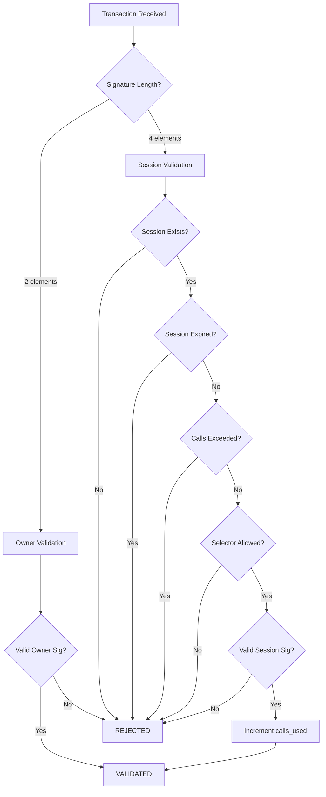

# Starknet Session Account

A Cairo smart contract that extends OpenZeppelin's account standard with session key functionality, enabling temporary, restricted access delegation on Starknet.

## 🚀 Deployed Contract

**Starknet Mainnet:**
- **Class Hash**: `0x023dc5d0d4f581c98d2e30e8a7317432e180e9f8b090e775339e3462c3de2949`
- **Reference Implementation**: `0x01b0b06255f6960219dc358114779fda563c3b817d2df3fbd214e67c3572fd7f`
- **Network**: Starknet Mainnet
- **Compiler**: Cairo 2.11.4
- **Deployed**: October 8, 2025

> ⚠️ **Note**: The reference implementation is provided as an example. For production use, deploy your own instance with your owner's public key.

### What's New in This Version

✨ **Predictable Session Signatures** - Fixed the chicken-and-egg problem! Session signatures now use only values known *before* transaction submission:
- Uses `account_address`, `chain_id`, `nonce`, `valid_until`, and call data
- **No longer requires `transaction_hash`** (which was unknown pre-submission)
- Enables true off-chain signature generation
- Maintains full security with replay protection via nonce

### Verify on Starkscan
- [View Class](https://starkscan.co/class/0x023dc5d0d4f581c98d2e30e8a7317432e180e9f8b090e775339e3462c3de2949)
- [View Reference Contract](https://starkscan.co/contract/0x01b0b06255f6960219dc358114779fda563c3b817d2df3fbd214e67c3572fd7f)

---

## 📜 License

MIT License

Copyright (c) 2025

Permission is hereby granted, free of charge, to any person obtaining a copy
of this software and associated documentation files (the "Software"), to deal
in the Software without restriction, including without limitation the rights
to use, copy, modify, merge, publish, distribute, sublicense, and/or sell
copies of the Software, and to permit persons to whom the Software is
furnished to do so, subject to the following conditions:

The above copyright notice and this permission notice shall be included in all
copies or substantial portions of the Software.

THE SOFTWARE IS PROVIDED "AS IS", WITHOUT WARRANTY OF ANY KIND, EXPRESS OR
IMPLIED, INCLUDING BUT NOT LIMITED TO THE WARRANTIES OF MERCHANTABILITY,
FITNESS FOR A PARTICULAR PURPOSE AND NONINFRINGEMENT. IN NO EVENT SHALL THE
AUTHORS OR COPYRIGHT HOLDERS BE LIABLE FOR ANY CLAIM, DAMAGES OR OTHER
LIABILITY, WHETHER IN AN ACTION OF CONTRACT, TORT OR OTHERWISE, ARISING FROM,
OUT OF OR IN CONNECTION WITH THE SOFTWARE OR THE USE OR OTHER DEALINGS IN THE
SOFTWARE.

---

## 🌟 Features

### Dual Signature Validation
- **Owner Path**: Standard ECDSA signature validation using the account's master public key
- **Session Path**: Temporary key validation with configurable restrictions

### Session Key Restrictions
- ⏰ **Expiration Time**: Sessions automatically expire after a specified timestamp
- 🔢 **Call Limits**: Maximum number of transactions allowed per session
- 🎯 **Selector Allowlist**: Restrict sessions to specific function selectors (or allow all)
- 🔐 **Cryptographic Security**: ECDSA signature verification using Stark curve

### Security Features
- ✅ Owner-only session management (add/revoke requires master key)
- ✅ Owner-only upgrades (preserves security model)
- ✅ Events emitted for session lifecycle (add/revoke)
- ✅ Automatic session invalidation on expiry
- ✅ Per-session call tracking
- ✅ Compatible with paymasters and transaction fee mechanisms

---

## 🏗️ Architecture

### Contract Structure

```
SessionAccount (extends OpenZeppelin AccountComponent)
├── Owner Validation (unchanged)
│   └── Standard 2-element signature [r, s]
├── Session Validation (new)
│   └── 4-element signature [session_pubkey, r, s, valid_until]
└── Session Management
    ├── add_or_update_session_key()
    ├── revoke_session_key()
    └── get_session_data()
```

### Signature Formats

**Owner Signature** (business as usual):
```
[r, s]
```

**Session Signature**:
```
[session_pubkey, r, s, valid_until]
```
- `session_pubkey`: Public key of the temporary session
- `r, s`: ECDSA signature components (signed by session private key)
- `valid_until`: Expiration timestamp (must match stored session)

### Session Message Hash Algorithm

The session signature is computed over a hash of **predictable, off-chain-computable values only**:

```cairo
fn _session_message_hash(
    calls: Span<Call>,
    valid_until: u64
) -> felt252 {
    let hash_data = [
        get_contract_address(),     // Account address (binding)
        tx_info.chain_id,           // Network identifier
        tx_info.nonce,              // Replay protection
        valid_until,                // Expiration
        // For each call:
        call.to,                    // Target contract
        call.selector,              // Function selector
        ...call.calldata            // All arguments (flattened)
    ];
    
    poseidon_hash_span(hash_data)
}
```

**Key Properties:**
- ✅ **No transaction_hash** - All values known before submission
- ✅ **Nonce prevents replay** - Each signature is single-use
- ✅ **Account binding** - Can't be used on different accounts
- ✅ **Chain binding** - Can't be replayed on other networks
- ✅ **Complete integrity** - Covers all call parameters

### Validation Flow



---

## 📦 Installation

### Prerequisites

- [Scarb](https://docs.swmansion.com/scarb/) v2.11.4+
- [Starknet Foundry](https://foundry-rs.github.io/starknet-foundry/) v0.50.0+

### Setup

```bash
# Clone the repository
git clone https://github.com/yourusername/starknet-session-account.git
cd starknet-session-account

# Build the contract
scarb build

# Run tests
snforge test
```

---

## 🚀 Usage Examples

### 1. Deploy the Account

```bash
# Declare the contract
sncast declare --contract-name Account --network mainnet

# Deploy with owner's public key
sncast deploy \
  --class-hash 0x<CLASS_HASH> \
  --constructor-calldata 0x<OWNER_PUBLIC_KEY> \
  --network mainnet
```

### 2. Add a Session Key (Owner Only)

```cairo
// From the owner's perspective
use session_account::{ISessionKeyManagerDispatcher, ISessionKeyManagerDispatcherTrait};

let account = ISessionKeyManagerDispatcher { contract_address };

// Create a session that:
// - Expires in 1 day
// - Allows up to 10 transactions
// - Restricts to transfer() and approve() functions only
account.add_or_update_session_key(
    session_public_key: 0x987654...,
    valid_until: get_block_timestamp() + 86400,  // 1 day
    max_calls: 10,
    allowed_entrypoints: array![
        0x83afd3f4...  // transfer selector
        0x219209e0...  // approve selector
    ]
);
```

### 3. Use a Session Key

```python
# Off-chain: Sign with session private key
from starknet_py.net.account.account import Account
from starknet_py.hash.selector import get_selector_from_name
from starknet_py.hash.hash_method import poseidon_hash_many

# Fetch current nonce (predictable value)
nonce = await account.get_nonce()

# Build the message hash with predictable values ONLY
# This can be computed BEFORE sending the transaction
hash_data = [
    account_address,          # Account contract address
    chain_id,                 # Network chain ID
    nonce,                    # Current nonce (fetch from account)
    valid_until,              # Session expiration timestamp
    # Flatten all call data
    call.to,                  # Target contract
    call.selector,            # Function selector
    *call.calldata            # Function arguments
]

message_hash = poseidon_hash_many(hash_data)

# Sign with session private key
r, s = sign_message(message_hash, session_private_key)

# Construct the signature
signature = [session_public_key, r, s, valid_until]

# Execute transaction with session signature
await account.execute(
    calls=[Call(
        to=token_address,
        selector=get_selector_from_name("transfer"),
        calldata=[recipient, amount_low, amount_high]
    )],
    signature=signature,
    nonce=nonce  # Use the same nonce we hashed
)
```

### 4. Revoke a Session (Owner Only)

```cairo
account.revoke_session_key(session_public_key: 0x987654...);
```

### 5. Query Session Data

```cairo
let session_data = account.get_session_data(session_public_key: 0x987654...);

// Returns:
// - valid_until: u64
// - max_calls: u32
// - calls_used: u32
// - allowed_entrypoints_len: u32
```

---

## 🧪 Testing

The project includes a comprehensive test suite with 13 tests covering all functionality.

### Run All Tests

```bash
snforge test
```

### Run Specific Tests

```bash
# Test owner validation
snforge test test_owner_signature_valid

# Test session expiration
snforge test test_session_expired

# Test call limits
snforge test test_session_max_calls

# Test selector restrictions
snforge test test_session_not_allowed_selector
```

### Test Coverage

| Category | Tests | Coverage |
|----------|-------|----------|
| Owner Validation | 1 | ✅ Owner signature validation |
| Session Validation | 5 | ✅ Valid, expired, max calls, invalid sig, selector restrictions |
| Session Management | 3 | ✅ Add, revoke, no restrictions, multiple calls |
| Authorization | 2 | ✅ Add/revoke unauthorized |
| Events | 1 | ✅ Event emissions |
| Upgrades | 1 | ✅ Owner-only upgrades |

### Sample Test Output

```
Collected 13 test(s) from sessions_smart_contract package
Running 13 test(s) from tests/
[PASS] test_owner_signature_valid
[PASS] test_session_signature_valid
[PASS] test_session_expired
[PASS] test_session_max_calls
[PASS] test_session_not_allowed_selector
[PASS] test_session_invalid_signature
[PASS] test_session_revoke
[PASS] test_session_with_no_restrictions
[PASS] test_session_multiple_calls_in_transaction
[PASS] test_add_session_unauthorized
[PASS] test_revoke_session_unauthorized
[PASS] test_session_events_emitted
[PASS] test_upgrade_still_owner_only
Tests: 13 passed, 0 failed, 0 ignored, 0 filtered out
```

---

## 🔐 Security Considerations

### ✅ Implemented Protections

1. **Owner Authority**
   - Only the account owner (via `assert_only_self()`) can add/revoke sessions
   - Owner can upgrade the contract implementation
   - Owner validation path remains unchanged from OpenZeppelin standard

2. **Session Isolation**
   - Each session has its own public key and usage tracking
   - Sessions cannot modify other sessions
   - Expired sessions are automatically rejected

3. **Cryptographic Integrity**
   - ECDSA signature verification on Stark curve
   - Message hash includes: account address, chain ID, nonce, valid_until, and full call data
   - **Nonce-based replay protection**: Each signature is single-use (tied to account nonce)
   - **Predictable pre-signing**: All hash components known before transaction submission
   - Prevents replay attacks across accounts, chains, and transactions

4. **Time-Based Security**
   - Sessions have mandatory expiration timestamps
   - No indefinite access delegation
   - Expiration checked on every validation

5. **Call Limiting**
   - Maximum calls enforced per session
   - Prevents abuse of compromised session keys
   - Usage tracked in storage

6. **Selector Restrictions**
   - Optional function allowlist
   - Prevents sessions from calling unintended functions
   - Empty allowlist = unrestricted (explicit choice)

### ⚠️ Known Limitations

1. **Session Key Management**
   - No on-chain session key revocation by session holder (only owner can revoke)
   - Consider off-chain key rotation strategies

2. **Gas Considerations**
   - Session validation adds gas overhead (~470k gas for signature check)
   - Consider this in fee estimation

3. **Selector Allowlist Size**
   - Large allowlists increase gas costs linearly
   - Recommend limiting to 10-20 selectors per session

4. **No Partial Revocation**
   - Revoking a session invalidates all remaining calls
   - Cannot reduce max_calls or modify restrictions after creation

### 🛡️ Best Practices

1. **Principle of Least Privilege**
   ```cairo
   // ✅ Good: Restrictive session
   add_session_key(
       session_key,
       valid_until: now + 1_hour,
       max_calls: 5,
       allowed_entrypoints: array![specific_selector]
   );
   
   // ❌ Bad: Overly permissive
   add_session_key(
       session_key,
       valid_until: now + 30_days,
       max_calls: 1000,
       allowed_entrypoints: array![]  // Unrestricted!
   );
   ```

2. **Short-Lived Sessions**
   - Mobile apps: 1-24 hours
   - Games: 1-7 days
   - Automated bots: 1 hour
   - Never exceed 30 days

3. **Appropriate Call Limits**
   - Batch operations: 50-100 calls
   - Daily usage: 10-20 calls
   - Single operation: 1-5 calls

4. **Key Storage**
   - Store session private keys in secure enclaves
   - Never expose session keys in client-side code
   - Implement key rotation

5. **Monitor and Audit**
   - Watch for `SessionKeyAdded` and `SessionKeyRevoked` events
   - Track unusual session usage patterns
   - Implement off-chain monitoring

---

## 🎯 Use Cases

### 1. Mobile Gaming
- Create session keys for game sessions
- Allow players to make in-game transactions without constant wallet confirmation
- Restrict to game contract functions only
- Auto-expire after play session

### 2. DeFi Trading Bots
- Delegate limited trading authority to automated strategies
- Restrict to DEX swap functions
- Set call limits to prevent runaway trading
- Short expiration for reduced risk

### 3. Subscription Services
- One-time session creation for recurring payments
- Restrict to payment contract
- Limit number of payments
- Expire after subscription period

### 4. Web3 Social Apps
- Background posting/liking without popups
- Restrict to social contract functions
- Daily usage limits
- Short-lived for security

### 5. Gasless Onboarding
- Sponsor new users with session keys
- Limited transactions for initial exploration
- Expire after trial period
- Upgrade to full account later

---

## 📚 API Reference

### ISessionKeyManager Interface

#### `add_or_update_session_key`

Adds a new session key or updates an existing one. **Owner-only**.

```cairo
fn add_or_update_session_key(
    ref self: TContractState,
    session_key: felt252,           // Public key of the session
    valid_until: u64,               // Expiration timestamp
    max_calls: u32,                 // Maximum number of calls
    allowed_entrypoints: Array<felt252>  // Allowed function selectors (empty = all)
);
```

**Emits**: `SessionKeyAdded(session_key, valid_until, max_calls)`

**Reverts**: If caller is not the account owner

---

#### `revoke_session_key`

Revokes a session key, making it immediately invalid. **Owner-only**.

```cairo
fn revoke_session_key(
    ref self: TContractState,
    session_key: felt252            // Public key to revoke
);
```

**Emits**: `SessionKeyRevoked(session_key)`

**Reverts**: If caller is not the account owner

---

#### `get_session_data`

Queries session information. **Public read**.

```cairo
fn get_session_data(
    self: @TContractState,
    session_key: felt252
) -> SessionData;

// Returns:
struct SessionData {
    valid_until: u64,              // 0 if session doesn't exist
    max_calls: u32,
    calls_used: u32,
    allowed_entrypoints_len: u32
}
```

---

### SRC-6 Interface (Account)

#### `__validate__`

Validates transaction signatures. Supports both owner and session signatures.

```cairo
fn __validate__(ref self: ContractState, calls: Array<Call>) -> felt252;
```

**Returns**: `starknet::VALIDATED` (1) if valid, 0 if invalid

**Signature Formats**:
- Owner: `[r, s]`
- Session: `[session_pubkey, r, s, valid_until]`

---

#### `__execute__`

Executes an array of calls after validation.

```cairo
fn __execute__(ref self: ContractState, calls: Array<Call>) -> Array<Span<felt252>>;
```

---

### Events

#### `SessionKeyAdded`

```cairo
struct SessionKeyAdded {
    #[key]
    session_key: felt252,
    valid_until: u64,
    max_calls: u32,
}
```

#### `SessionKeyRevoked`

```cairo
struct SessionKeyRevoked {
    #[key]
    session_key: felt252,
}
```

---

## 🔧 Development

### Project Structure

```
starknet-session-account/
├── src/
│   ├── lib.cairo              # Module exports
│   └── account.cairo          # Main contract + session logic
├── tests/
│   └── test_session_validation.cairo  # Full test suite
├── scripts/
│   ├── add_session_key.sh     # Example: Add session
│   └── revoke_session_key.sh  # Example: Revoke session
├── Scarb.toml                 # Project config
└── README.md                  # This file
```

### Dependencies

```toml
[dependencies]
starknet = ">=2.8.0"
openzeppelin = { git = "https://github.com/OpenZeppelin/cairo-contracts.git", tag = "v2.0.0" }
snforge_std_deprecated = { git = "https://github.com/foundry-rs/starknet-foundry.git", tag = "v0.50.0" }
```

### Building

```bash
# Development build
scarb build

# Clean build
scarb clean && scarb build

# Format code
scarb fmt
```

### Testing

```bash
# Run all tests
snforge test

# Run with gas profiling
snforge test --detailed-resources

# Run specific test
snforge test test_name

# Verbose output
snforge test -v
```

---

## 🤝 Contributing

Contributions are welcome! Please follow these guidelines:

1. **Fork** the repository
2. **Create** a feature branch (`git checkout -b feature/amazing-feature`)
3. **Write** tests for new functionality
4. **Ensure** all tests pass (`snforge test`)
5. **Format** code (`scarb fmt`)
6. **Commit** changes (`git commit -m 'Add amazing feature'`)
7. **Push** to branch (`git push origin feature/amazing-feature`)
8. **Open** a Pull Request

### Code Style

- Follow Cairo best practices
- Add comments for complex logic
- Write comprehensive tests
- Update documentation

---

## 📖 Additional Resources

- [Starknet Documentation](https://docs.starknet.io/)
- [Cairo Book](https://book.cairo-lang.org/)
- [OpenZeppelin Cairo Contracts](https://github.com/OpenZeppelin/cairo-contracts)
- [Starknet Foundry](https://foundry-rs.github.io/starknet-foundry/)
- [Account Abstraction on Starknet](https://docs.starknet.io/documentation/architecture_and_concepts/Accounts/introduction/)

---

## ⚖️ Disclaimer

This software is provided "as is", without warranty of any kind. Use at your own risk. Always audit smart contracts before deploying to mainnet with real funds.

---

## 📞 Support

- **Issues**: [GitHub Issues](https://github.com/yourusername/starknet-session-account/issues)
- **Discussions**: [GitHub Discussions](https://github.com/yourusername/starknet-session-account/discussions)

---

Made with ❤️ for the Starknet ecosystem
